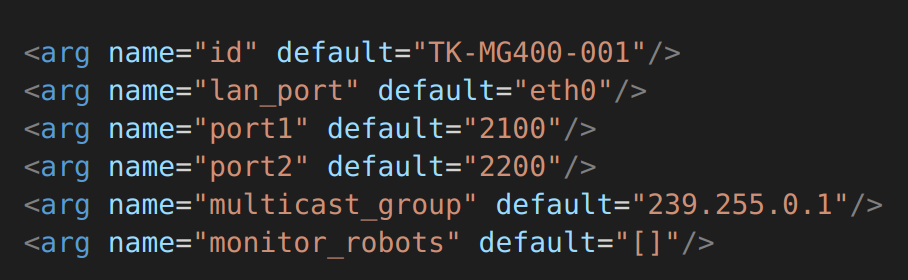
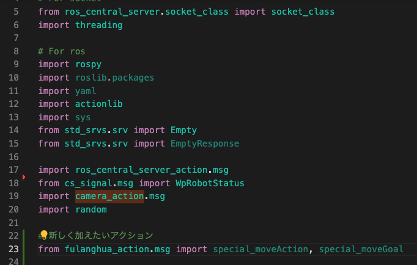
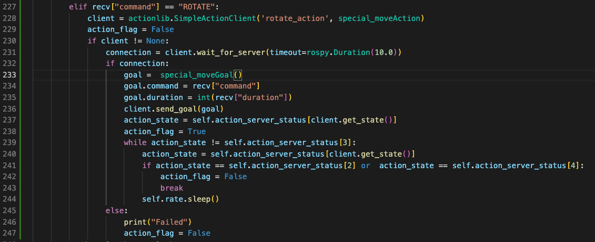
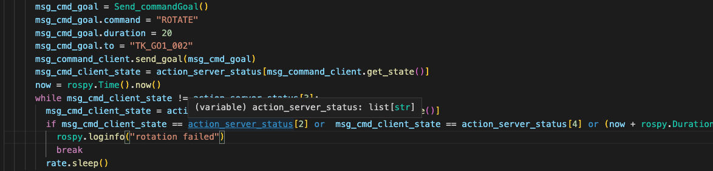

# ROS_central_servers仕様書
## 著者：大島　航


## Index

### 作成の目的
### 主な機能
### 実装方法
### 動作一例
### カスタムコマンドの実装

## 作成の目的

このセントラルサーバーの作成に当たって気をつけたことは、サーバーがROS依存しないことである。兼田さんとも何度か話したが、ROSは限定的な使用にとどめるであり、例えば今回のように端末を飛び越えて通信を行う場合や、それぞれがマスターとしての役割を持ち、複数のロボットを管理する必要がある際はROSからの脱却を行う必要がある。今回のセントラルサーバーはクライアントはそれぞれの端末のROSに紐づいているがサーバーはPython3系が入っているどのOSであっても動作する。（動作確認OS：Windows,MacOS, Linux）なので、統合管理PCとしてどの端末を用いてもよい。また、拡張性を高くするために、通信方式の部分はともかくとして、コマンドの追加やサーバーに投げたい情報はなるべく平易に書いているので、誰が見てもわかるようにした。このセントラルサーバーの目的は、主に、異なるマスター間のアクションコマンド・サービスのやり取り、中央集権的な情報の管理、複数ロボットの監視である。


## 主な機能

### 煩雑な設定の排除
### ロボット間のシームレス通信	(tcp)
### 現在位置、WP、Robotステイタスチェック(udp)
### 複数ロボット間の状態監視(tcp)
### その他

### 煩雑な設定の排除
サーバーとクライアントを構築するうえで、必要な設定はそれぞれがサーバーと同一のネットワークに所属しているかどうかである。これはサーバーがそれらとネットワークを通してやり取りができれば、クライアント同士が同一ネットワークにいる必要はない。<br>
ユーザーは各ロボットのip-addressを知る必要はなく、事前に決めておいた各ロボットのユニークＩＤさえプログラムに入れておけば、どのネットワークでも変わらずに動作可能である。（これはネットワークが変わるたびに色々と誤作動が起きることを事前に防ぐため）<br>
またサーバーはサーバーが起動しているＰＣ（ＯＳは問わず）のネットワークインターフェイス全てに対して受け入れ態勢を作るので（ループアドレスは除く）、ユーザー側で特にどのインターフェイスに割り当てるかどうかは気にしなくてよい
また、中央集権サーバーとしての特徴として、もしサーバーとの通信が切れた場合はただちにクライアント側はプログラムを終了させる。これは、サーバーを通して動作させるプログラムで誤作動を起こさないためである。<br>
現在はそのクライアントのみを終了させているが必要であれば全てのROSノードを終了させることも可能 <br>


### ロボット間のシームレス通信

各ロボットがユニークなIDを持つことで、サーバー（ROSレス）側がそれぞれのロボットへの通信（wireless/wired問わず）を個別に管理<br>
例えばロボットAがロボットBへコマンドを送りたかった場合、ロボットAはロボットBのユニークIDさえ知っていれば、そのIPアドレスを知る必要なくロボットBへコマンドを送信できる。サーバーは受け取ったIDを基にルーティングテーブルから特定のIPアドレスを取得し、ロボットAからのコマンドをロボットBを送信。ロボットBは受け取ったコマンドを実行し、成功失敗判定（アクションリブの結果）をロボットAに返信。<br>
これにより、ROS1のネックであったマスターが一つしか持てない問題は解決。（各ロボットがROSマスターになれるため) <br>


### 現在位置、WP、Robotステイタスチェック
各Robotはサーバーに対して、現在位置と次へ向かうWPの座標、そして自身のステイタスをサーバーに逐一送信します。
サーバーは受け取った情報をロボットのユニークＩＤから参照し更新します。<br>
サーバーはＭＡＰをＰｙｇａｍｅで簡易的に表示し更新された情報を基に、ロボットとWPの座標を表示し、ステイタスに応じて色を変えます。（現在PygameのMapとPGMのMAPの座標の整合性を取組中）<br>

### 複数ロボット間の状態監視
上記の情報更新において、サーバーは各ロボットをIDで管理できているので、同一MAＰに任意の数のロボットを表示できる。加えてロボットの状態も管理できるので例えば、ロボットが据え置きの充電ステーションに向かいたいときにそのステーションが使用中かどうかの問い合わせができる。


### その他
上記の機能は最低限必要な機能のみ実装しているが、その用途は汎用的なので、必要な機能があれば逐次追加予定である。


##  実装方法
Dependencies
```
cs_signal (https://github.com/TechShare-inc/cs_signal.git)<br>
camera_action (https://github.com/Wataru-Oshima-Tokyo/camera_pkgs.git) <br>
```
ここでは、ros_central_serverの実装方法を記載する。
Techshare-incのGithubからros_central_serversをClone 
```
git clone https://github.com/TechShare-inc/ros_central_servers.git
```
ros_central_servers/ros_central_serverへ移動
```
cd {yourworkspace}/ros_central_servers/ros_central_server
```
以下のコマンドを実行
For Jetson(Client side)
```
bash install_for_jetson.sh 
```
For pc which only plays a role of server
```
bash install_for_server.sh
```
catkin build ros_central_serverを実行
```
catkin build ros_central_server
```
client.launchを参考に、個別にlaunchファイルを作成しidのdefaultをユニークidに変更(推奨)、もしくはclient.launchの中のidのdefaultをユニークidに変更<br>

同Launchファイルのlan_portのdefaultをserverへ繋げたいinterface名に変更<br>
monotior_robotsの中にはそのクライアント内で監視したいロボットのユニークIDを","続きで入れてください。<br>
例[TK_GO1_002,LIMO_001]<br>
#### Client roslaunch実行<br>
```
roslaunch ros_central_server <作成したlaunchファイル>
```


#### Server *(引数は０もしくは１で、１の場合Mapが表示されます。)

```
cd ros_cnetral_servers/ros_central_server/scripts
python3 server.py 0　　
```

#### Bridge (Go1の内部など外のネットワークと繋がっていない場合に、それにEthernetなどで繋がっており、かつ外とコミュニケーションが取れるデバイスにつける)<br>
network_bridge.pyは二つの引数を取ります。<br>
それぞれネットワークのインターフェイスを入れますが、一番目が内部（外のネットワークと繋がっていないデバイスとコミュニケーションが取れるインターフェイス）<br>
2番目が外部（サーバーが存在するネットワーク）のインターフェイス名を入れます。<br>
例：python3 network_bridge.py eht0 wlan0<br>
(デフォルトはeth0とWlan0になっています。)<br>
```
cd ros_cnetral_servers/ros_central_server/scripts
python3 network_bridge.py {Internal interface} {External interface}　　
```


＊尚 server.pyはros_central_server/ros_central_server/scripts内で実行してく


#### 命令の与え方
命令はアクションリブを通して行います。 <br>
アクションの名前は/msg_commandです。 <br>

以下がアクションの引数です。<br>
command　- 与えたいコマンドをString型で <br>
duration: 　-コマンドの秒数をInt型で <br>
result: 　　- 基本はNone（プログラム側で作成）<br>　
to: 　　　- コマンドを送りたい相手のユニークID <br>


### 動作一例
https://user-images.githubusercontent.com/62457768/216167897-d0e59df1-a4cb-494d-9ade-510b9ef581fa.mp4


### カスタムコマンドの実装
もし、自身でカスタムコマンドを作成したいときの手順を記載します。<br>
変更する部分は全てclient.py内です。<br>
***
受信する側（実際にそのアクションを行う側）のclient.py <br>
(例：fulanghua_actionを新たに入れたいとき)
#### 1. action commmandをimportする

#### 2. そのアクションに該当する名前（ユニーク）を決定する。

#### 3. 以下の部分にサーバーを呼び出すコマンドを作成する。



***
送信する側のプログラム（msg_command/goalを呼び出すプログラム） <br>
#### 1. msg_commandのcommandを上記で決めた名前にする



* 以上、もし何か不明な点があればお知らせください。


# RCS: DISPATCH
Each message sent through RCS Dispatch should adhere to the below protocols.
Though the messages are just JSON payloads, only the below formats will be supported.

### Protocol Message Types:
  - **COMMAND**
    - sender: <str> `name of the robot sending the message`
    - timestamp: <float> `timestamp of message creation`
    - msgtype: "COMMAND" `message type`
    - destination: <str> `name of the robot intended to recieve the message`
    - command: <str> `command intended to be parsed by clients`
    - command_id: <str> `randomly generated id used by clients to keep track of sent/recieved commands`
    - duration: <float> `duration allowed for the process`
  - **RESPONSE**
    - sender: <str> `name of the robot sending the message`
    - timestamp: <float> `timestamp of message creation`
    - msgtype: "RESPONSE" `message type`
    - destination: <str> `name of the robot intended to recieve the message`
    - command_id: <str> `randomly generated id used by clients to keep track of sent/recieved commands`
    - result: <str> `result of the action performed to be sent back to the action caller`
  - **TELEMETRY**
    - sender: <str> `name of the robot sending the message`
    - timestamp: <float> `timestamp of message creation`
    - msgtype: "TELEMETRY" `message type`
    - > Varies by robot 
